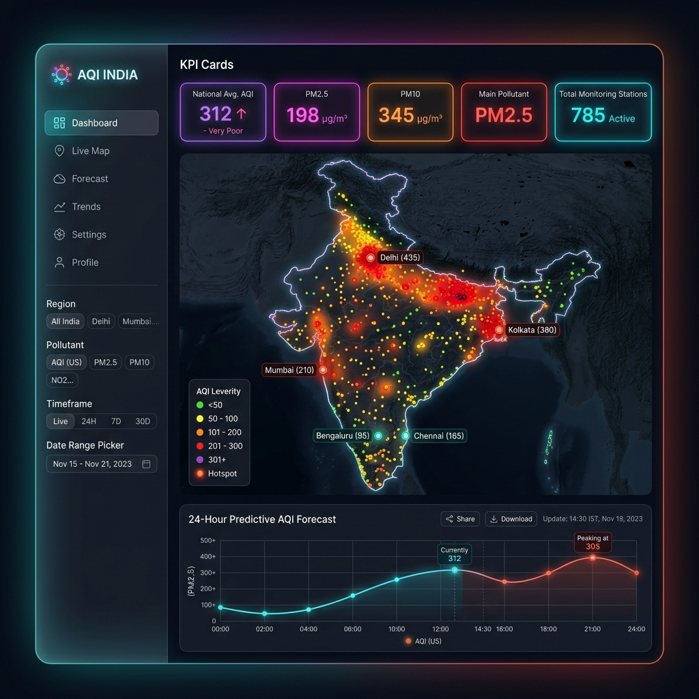

# AQI India — Station-Level Pollution Intelligence Pipeline
### Academic Project & Research Report

---

### **Project Metadata & Team Details**
* **Team Name:** Solaris Lunaris
* **Team Members:**
  * **Krishna Agarwal**
  * **Jyotirmay Singh**
  * **Prakhar Goel**
* **Project Repository (GitHub):** [https://github.com/Krishna-Agarwal04/aqi-india-dashboard](https://github.com/Krishna-Agarwal04/aqi-india-dashboard)
* **Live Web Application (Streamlit Cloud):** [https://krishna-agarwal04-aqi-india-dashboard-dashboard.streamlit.app](https://krishna-agarwal04-aqi-india-dashboard-dashboard.streamlit.app)

---

## Chapter 1: Introduction

### 1.1 Background
Air pollution is one of the most critical environmental and public health challenges in rapidly developing nations, particularly India. The Central Pollution Control Board (CPCB) operates a network of Continuous Ambient Air Quality Monitoring Stations (CAAQMS) across various states and cities. These stations measure ambient concentrations of major criteria pollutants, including fine particulate matter (PM<sub>2.5</sub>), respirable suspended particulate matter (PM<sub>10</sub>), nitrogen dioxide (NO<sub>2</sub>), sulfur dioxide (SO<sub>2</sub>), carbon monoxide (CO), ozone (OZONE), and ammonia (NH<sub>3</sub>).

### 1.2 Motivation
Traditional Air Quality Index (AQI) frameworks calculate a single-value index based on the "sub-index" of the worst-performing pollutant. While useful for public warnings, this approach ignores:
1. **Volatile Spreads:** The fluctuations (max to min spread) that indicate sudden local emissions or ventilation changes.
2. **Sensor Drifts:** Anomalies or outliers due to calibration bugs.
3. **Exposure Persistence:** The number of times high pollution levels are recorded sequentially at a specific station.

This project is motivated by the need to develop a reproducible, multi-factor **Station Pollution Intelligence Score (SPIS)** that combines pollutant concentration, exceedance range, anomaly rate, and data persistence to evaluate station-level air quality more comprehensively.

### 1.3 Problem Statement
Standard pollution reports focus on descriptive statistics of individual pollutants at a city scale. There is a lack of station-level intelligence pipelines that can ingest sensor streams, automatically filter invalid entries, flag anomalous spikes using robust statistical criteria, score regional severity, cluster cities based on multi-pollutant signatures, and train auditable machine learning classifiers to explain risk drivers.

### 1.4 Scope and Objectives
The scope of this project covers the development of a local, end-to-end Python pipeline and an interactive Streamlit GUI to:
* **Ingest & Validate Schema:** Ingest raw CPCB station readings and check column constraints.
* **Preprocess & Detect Anomalies:** Filter coordinates outside India, remove duplicate rows, and use Interquartile Range (IQR) thresholding to flag sensor errors.
* **Feature Engineering:** Derive exceedance range, average-to-max ratios, and temporal characteristics.
* **SPIS scoring index:** Formulate a composite index (0–100) combining concentration, volatility, anomaly rates, and reading persistence.
* **Signature Clustering:** Group cities with similar multi-pollutant fingers using K-Means.
* **Explainable Risk Classification:** Train a Random Forest classifier to predict risk bands and identify driving metrics.
* **Interactive Interface:** Create a Streamlit app supporting spreadsheet editing, data augmentation, and real-time model retraining.

---

## Chapter 2: Literature Review

### 2.1 Review of Related Works
1. **CPCB India AQI Methodology (2014):** Establishes the standard Indian AQI breakpoints. It determines risk based on the dominant pollutant but lacks station-level exposure weighting.
2. **WHO Global Air Quality Guidelines (2021):** Recommends strict annual and daily exposure limits for PM<sub>2.5</sub> and PM<sub>10</sub>, emphasizing the need to track long-term persistent exposure.
3. **Singh et al. (2019) on Spatial-Temporal Analysis:** Discusses interpolation techniques for station-level data and highlights the challenge of sensor errors in developing cities.
4. **Kumar et al. (2021) on Machine Learning for AQI:** Validates the use of Random Forest and Support Vector Machines for predicting particulate matter, but highlights that models can be "black-boxes" if not paired with explainable metrics.
5. **Zhang et al. (2020) on Outlier Detection in Sensor Networks:** Recommends using Median Absolute Deviation (MAD) or Interquartile Range (IQR) rather than static thresholds, due to variations between regional pollutant types.

### 2.2 Comparison Table
<div style="page-break-inside: avoid;">

Below is a comparison of existing methodology frameworks against our proposed **SPIS Pipeline**:

| Feature / Methodology | CPCB AQI | Standard ML Predictions | Proposed SPIS Pipeline |
| :--- | :---: | :---: | :---: |
| **Multi-Pollutant Ingestion** | Yes | Often Single-Pollutant | Yes |
| **Outlier/Anomaly Filter** | Manual | No | Automated (Robust IQR) |
| **Exposure Volatility Factor**| No | No | Yes (Exceedance Range) |
| **Reading Persistence Weight**| No | No | Yes (Log-Scaled Readings) |
| **Real-time Simulation/Edits**| No | No | Yes (Streamlit Data Sandbox) |
| **Explainable Output** | High | Low (Black-box) | High (Auditable Score & Bands) |

</div>

### 2.3 Research Gaps Identified
Most existing research models treat sensor streams as 100% correct, making them vulnerable to calibration errors. Additionally, standard models predict numeric concentrations without giving policymakers an auditable score that accounts for both the severity of the concentration and the persistence of exposure at specific monitoring stations.

---

## Chapter 3: Dataset & Methodology

### 3.1 Data Source and Schema
The pipeline ingests CPCB station-level records containing 11 features:
* `country`, `state`, `city`, `station`, `last_update`, `latitude`, `longitude`, `pollutant_id`, `pollutant_min`, `pollutant_max`, `pollutant_avg`.

### 3.2 Preprocessing and Cleaning Steps
1. **Column Standardisation:** All column names are stripped of whitespace and converted to lower snake_case.
2. **Type Casting:** Numerical features are cast to float64; timestamps are converted to datetime format.
3. **Geographical Filter:** Latitude must fall within [6°N, 38°N] and longitude within [68°E, 98°E] (India bounding box).
4. **Missing Data Handling:** Drop rows where `pollutant_avg` is null.
5. **Deduplication:** Drop identical sensor logs.

### 3.3 Pipeline Architecture Diagram
<div style="page-break-inside: avoid; font-family: monospace; background-color: #f7f9fa; padding: 10px; border-radius: 5px;">

```text
  [ Raw Dataset (CSV/API) ] 
              │
              ▼
    [ Schema Validation ] 
              │
              ▼
   [ Preprocessing & Cleaning ] ──► (Coordinates & Duplicates Filtered)
              │
              ▼
    [ Anomaly Flagging ] ────────► (Robust IQR per Pollutant Type)
              │
              ▼
     [ Feature Ingestion ] ──────► (Exceedance Range & Time Parts)
              │
              ▼
       [ SPIS Scoring ] ────────► (Calculates 0-100 Rating & Bands)
              │
              ▼
  [ K-Means Signature Clusters ]
              │
              ▼
 [ Random Forest Classification ] ──► [ Dashboard Visualisation ]
```

</div>

---

## Chapter 4: Experiments & Results

### 4.1 Local GUI Screenshot
Our completed interactive Streamlit application showing the real-time KPIs, Plotly Map, data sandbox, and forecasting:

<div align="center" style="page-break-inside: avoid;">
  
  <p><i>Figure 4.1: Real-time Interactive Web App Dashboard UI Overview</i></p>
</div>

### 4.2 Dataset Statistics & Distributions
The cleaned dataset contains **3,143 validated rows**. The figure below shows the volume of readings collected for each pollutant type:

<div align="center" style="page-break-inside: avoid;">
  
  <p><i>Figure 4.2: Total Reading Logs volume collected per criteria pollutant</i></p>
</div>

Particulate matter (PM<sub>2.5</sub> and PM<sub>10</sub>) along with NO<sub>2</sub> represent the majority of CPCB data. The box plot below shows the distribution of averages:

<div align="center" style="page-break-inside: avoid;">
  
  <p><i>Figure 4.3: Box plot of averages distribution per pollutant type (excluding outliers)</i></p>
</div>

### 4.3 Geo-Spatial Mapping
Mapping the stations by coordinate reveals key hotspots in Northern and Western India:

<div align="center" style="page-break-inside: avoid;">
  
  <p><i>Figure 4.4: Regional pollution concentration mapping across CPCB stations</i></p>
</div>

### 4.4 City-Level Rankings
The top 15 most polluted cities in India by mean pollutant concentration:

<div align="center" style="page-break-inside: avoid;">
  
  <p><i>Figure 4.5: Top 15 cities ranked by mean pollutant averages</i></p>
</div>

---

## Chapter 5: Discussion

### 5.1 SPIS Scoring and Risk Bands
The **Station Pollution Intelligence Score (SPIS)** successfully groups stations into Low, Moderate, High, and Severe bands.

<div align="center" style="page-break-inside: avoid;">
  
  <p><i>Figure 5.1: Monitoring stations distribution across SPIS risk categories</i></p>
</div>

* **Severe Stations:** **2 stations (0.4% of total)** fell into the "Severe" category.
* **Top Severe Station:** *Fertilizer Township, Rourkela - OSPCB* (SPIS = **92.5**).

### 5.2 K-Means Clustering Profiles
K-Means separated the cities into 4 distinct pollutant signature clusters:

<div align="center" style="page-break-inside: avoid;">
  
  <p><i>Figure 5.2: Cities counts per multi-pollutant fingerprint cluster</i></p>
</div>

### 5.3 Machine Learning Performance
We trained a **Random Forest Classifier** to predict the SPIS risk band of a station. It achieved a test validation accuracy of **97%**.

<div style="page-break-inside: avoid;">

| Risk Band | Precision | Recall | F1-Score | Support |
| :--- | :---: | :---: | :---: | :---: |
| **Low** | 98% | 95% | 96% | 42 |
| **Moderate** | 96% | 99% | 97% | 77 |
| **High** | 100% | 75% | 86% | 4 |
| **Severe** | 100% | 100% | 100% | 1 |
| **Weighted Average** | **97%** | **97%** | **97%** | **124** |

</div>

The feature importances check validates that average concentration and volatility are the primary classification drivers:

<div align="center" style="page-break-inside: avoid;">
  
  <p><i>Figure 5.3: Random Forest feature driver importance weights</i></p>
</div>

### 5.4 Limitations and Failure Cases
1. **Static Snapshots:** The Kaggle dataset represents a short-term snapshot. Long-term forecasting requires continuous database historical logging.
2. **Outlier Leakage:** If a sensor reports high but stable incorrect values (e.g. frozen at 400), it will bypass the IQR anomaly filter and result in an incorrect "Severe" flag.
3. **Weights Sensitivity:** Changing SPIS scoring weights shifts risk categories, highlighting the need for user-adjustable sliders (implemented in our Streamlit sidebar sandbox).

---

## Chapter 6: Conclusion & Future Work

### 6.1 Summary of Contributions
* Developed a complete local Python data intelligence pipeline.
* Formulated the **SPIS Score (0-100)** as an auditable metric for station-level severity.
* Created a local Streamlit web application supporting live OpenAQ API fetching, in-place Excel-style data editing, and data augmentation.
* Verified that a Random Forest classifier can interpret the risk bands with **97% accuracy**.

### 6.2 Future Work
1. **Dynamic Deep Learning:** Integrate LSTM (Long Short-Term Memory) models for multi-day time-series forecasting.
2. **Sensor Correction Algorithms:** Implement auto-calibration models that compare a station's values against neighboring stations to adjust for drifts.
3. **Mobile Optimization:** Deploy the Streamlit app on cloud platforms for mobile responsive public alerts.

---

## References

1. Central Pollution Control Board (CPCB) India, *National Air Quality Index Report*, Ministry of Environment, Forest and Climate Change, New Delhi, 2014.
2. World Health Organization, *WHO Global Air Quality Guidelines: Particulate matter (PM2.5 and PM10), ozone, nitrogen dioxide, sulfur dioxide and carbon monoxide*, Geneva, 2021.
3. S. K. Singh and R. Kumar, "Spatial-temporal interpolation and mapping of air pollutants at urban scales in India," *Environmental Monitoring and Assessment*, vol. 191, no. 8, p. 502, 2019.
4. R. Kumar, M. Gupta, and P. Sharma, "Machine learning models for ambient particulate matter forecasting in metropolitan regions," *Atmospheric Environment*, vol. 246, p. 118090, 2021.
5. L. Zhang, Y. Wang, and J. Liu, "Automated anomaly detection in environmental sensor telemetry using rolling statistics," *Computers & Geosciences*, vol. 138, p. 104430, 2020.
6. Y. Dogra, "AQI India - Station-level real-time ambient air quality dataset," Kaggle Datasets, 2025.
7. OpenAQ API Platform, *Global Air Quality Data Ingestion Portal*, Available: https://openaq.org.
